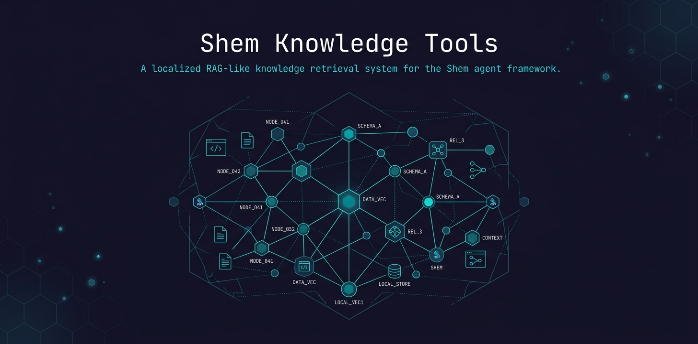

<p align="center">
  
</p>

<h1 align="center">Shem Knowledge Tools</h1>

<p align="center">
  A <a href="https://github.com/thephilip/shem">Shem</a> tool pack that gives LLM agents local-first semantic memory — index documents, search by meaning, and manage knowledge collections, all 100% offline.
</p>

## Install

```bash
shem-install https://github.com/thephilip/shem-knowledge-tools
```

Or from a local path:

```bash
shem-install file:///path/to/shem-knowledge-tools
```

## Usage

A single `knowledge` tool dispatches by `action`. All data lives in `~/.config/shem/knowledge/` — nothing leaves your machine.

| Action | Parameters | Returns | Use case |
|---|---|---|---|
| **index** | `text`, `source` (opt), `collection` (opt) | chunk count, collection name | "Save this page about Erlang supervisors" |
| **search** | `query`, `collection` (opt), `n` (opt, default 5), `threshold` (opt, default 0.0), `source` (opt) | ranked results with scores | "What did I save about distributed Erlang?" |
| **list** | none | collection names and doc counts | "What knowledge collections exist?" |
| **delete** | `name` | confirmation | "Remove that old project collection" |

The default collection is `"default"` — for simple use you only need `text` (index) or `query` (search).

**Scenarios:**

- **Build a knowledge base:** `index` documents as you read them, with `source` set to the URL or file path for traceability
- **Retrieve relevant context:** `search` by meaning — no keyword matching, returns semantically similar passages with a 0–1 relevance score. Pass `source` to filter results to a specific source.
- **Organize by project:** use `collection` to keep separate indexes (e.g., "elixir-notes", "project-x-specs")
- **Clean up:** `delete` stale collections; `list` to see what you have

## Requirements

- **Python 3** with `chromadb` installed: `pip install chromadb`

### First-run model download

On first `index` or `search`, ChromaDB automatically downloads the `all-MiniLM-L6-v2` embedding model (~80 MB) to `~/.cache/chroma/onnx_models/`. This is a tiny ONNX model that converts text to vectors for similarity search — it is **not an LLM**, cannot generate text, and runs entirely locally. One-time download, no API keys, no phone-home.

The download requires network access on first run. To pre-seed without network grants, download on host and copy `~/.cache/chroma/onnx_models/` into the sandbox.

### Prompt injection defense

Search results are unsanitized content from indexed documents — anything you indexed (crawled page, pasted doc, user note) can carry an injection payload. The tool strips Unicode tag characters, scans for known injection patterns, and wraps flagged results in `<untrusted>...</untrusted>` markers before returning them to the model.

## Data Location

All collections are stored at `~/.config/shem/knowledge/`. Back up or delete this directory as needed.

## License

Apache 2.0 — see LICENSE and NOTICE.
